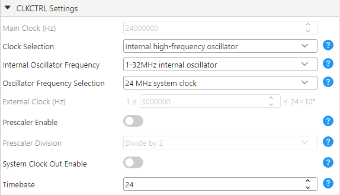

<!-- Please do not change this logo with link -->

<a target="_blank" href="https://www.microchip.com/" id="top-of-page">
   <picture>
      <source media="(prefers-color-scheme: light)" srcset="images/mchp_logo_light.png" width="350">
      <source media="(prefers-color-scheme: dark)" srcset="images/mchp_logo_dark.png" width="350">
      
   </picture>
</a>

# USB Vendor Data Transfer Demo
This example demonstrates how the Vendor class on the AVR® DU microcontroller (MCU), paired with the AVR64DU32 Curiosity Nano Board, enables data transfer to and from a PC through interrupt, bulk, and isochronous transfers.

## Related Documentation
- [AVR® DU Family Product Page](https://www.microchip.com/en-us/products/microcontrollers-and-microprocessors/8-bit-mcus/avr-mcus/avr-du?utm_source=GitHub&utm_medium=TextLink&utm_campaign=MCU8_AVR-DU&utm_content=avr64du32-cnano-usb-vendor-mplab-mcc-github&utm_bu=MCU08)
- [AVR64DU32 Chip](https://www.microchip.com/en-us/product/AVR64DU32?utm_source=GitHub&utm_medium=TextLink&utm_campaign=MCU8_AVR-DU&utm_content=avr64du32-cnano-usb-vendor-mplab-mcc-github&utm_bu=MCU08)

### USB Specifications
- [USB 2.0 Specification](https://www.usb.org/document-library/usb-20-specification)

## Software Used

- [MPLAB® X IDE 6.20](https://www.microchip.com/en-us/tools-resources/develop/mplab-x-ide?utm_source=GitHub&utm_medium=TextLink&utm_campaign=MCU8_AVR-DU&utm_content=avr64du32-cnano-usb-vendor-mplab-mcc-github&utm_bu=MCU08) or newer
- [MPLAB® XC8 Compiler 2.46](https://www.microchip.com/en-us/tools-resources/develop/mplab-xc-compilers?utm_source=GitHub&utm_medium=TextLink&utm_campaign=MCU8_AVR-DU&utm_content=avr64du32-cnano-usb-vendor-mplab-mcc-github&utm_bu=MCU08) or newer
- [MPLAB® Code Configurator (MCC) 5.5.0](https://www.microchip.com/en-us/tools-resources/configure/mplab-code-configurator?utm_source=GitHub&utm_medium=TextLink&utm_campaign=MCU8_AVR-DU&utm_content=avr64du32-cnano-usb-vendor-mplab-mcc-github&utm_bu=MCU08) or newer

## Hardware Used

- [AVR64DU32 Curiosity Nano (EV59F82A)](https://www.microchip.com/en-us/development-tool/EV59F82A?utm_source=GitHub&utm_medium=TextLink&utm_campaign=MCU8_AVR-DU&utm_content=avr64du32-cnano-usb-vendor-mplab-mcc-github&utm_bu=MCU08)

## Setup

### Physical Setup

The AVR DU Curiosity Nano development board has two USB-C ports
1. The Debugger port programs the device with the code example
2. After programming, the cable connected to the Debugger may be disconnected, but it will not affect the example if it remains
3. The Target port must be connected to the PC in order to transfer data between the decive and the PC

### MCC Setup

This section shows how the example is set up using MPLAB® Code Configurator (MCC).

### USB Device Stack Setup

#### USB General Settings
Set the class configuration to Vendor, so that the AVR DU will use the USB vendor protocol to communicate with the PC. 

#### USB Device Descriptors
The Device Descriptors can be left as default.

#### USB Interfaces
For this example, Interface 0 with Alternates 0-4 is required, click "Add Interface" to add them. Alternate 0 will remain as it is.

#### USB Vendor Endpoints
We must set up separate endpoints for the interrupt, bulk, and isochronous transfers. To configure the endpoints, click "Add Endpoint" and select the correct configurations corresponding to each Alternate, 1 to 4.

#### USB0 Power Settings
By default, the target voltage on the AVR64DU32 Curiosity Nano is 3.3V and VUSB is connected to 3.3V using the provided jumper. However, if 5V operation is preferred, the jumper must be removed and the internal USB voltage regulator must be enabled.

### Device Clock Setup
This example is configured to run on 24 MHz under *System Firmware -> CLKCTRL*. The minimum oscillator frequency available for USB on the AVR DU is 12 MHz.

### USB Voltage Detection Setup
To ensure that the USB peripheral only tries to attach to the bus when the Curiosity Nano is connected to the PC, the Analog Comparator will periodically check if the voltage is within the acceptable range for VBUS.

#### Voltage Reference Setup (VREF)
The Voltage Reference is set to 2.048V.

#### Analog Comparator Setup (AC)

##### Analog Comparator Hardware Settings
The Analog Comparator must be enabled by toggling Enable under Hardware Settings.
To measure the correct values, the positive input must be connected to AINP4, while the negative input is set to the DAC Reference.
The DACREF register must be set to a value that can detect the correct voltage level at a minimum of 0.4V. The reference voltage 0.48V (DACREF = 60) used in this project is a little higher to ensure a stable connection. Refer to the [AVR64DU32 Curiosity Nano User Guide](https://ww1.microchip.com/downloads/aemDocuments/documents/MCU08/ProductDocuments/UserGuides/AVR64DU32-Curiosity-Nano-UserGuide-DS50003671.pdf) to find the values for the voltage divider on Pin PC3.

#### Real-Time Counter Setup (RTC)

##### Real-Time Counter Periodic Interrupt Control Settings
The Periodic Interrupt Timer (PIT) is enabled for this example, and the period selection is set to RTC Clock Cycles 1024. This value must be changed according to the clock source selection.
The PIT's Interrupt Flag is also enabled to allow for an interrupt routine.

### Interrupt Manager
Global interrupts must be enabled for the RTC and the USB communication to work.

### Device Pin-out Setup
One pin is used for this example: VBUS on PC3 set as input with "Digital Input Buffer disabled". This can be verified under *System Firmware -> Pins*.

## Operation

This example can be tested by following these steps:

1. Generate the MCC code and replace the generated main.c file with the given main.c from the source code
2. Upload the c-code by connecting the Debugger plug on the Curiosity Nano Board (cnano) to the PC
3. Connect the PC to the Target plug on the cnano and install the libusbK driver as shown in [Driver Installation](#driver-installation)
4. Run the python script ``vendor_endpoints.py`` from the given python_test code and see the data transfer

## Driver Installation
A USB driver is required to enumerate vendor devices. The LibusbK driver is recommended to handle isochronous transfers, it can be downloaded from here: https://zadig.akeo.ie/ (choose libusbK after downloading). 
Make sure to select the correct device from the drop-down menu, with VID = 0X04D8 and PID = 0X0B0A. 
If the device does not show up, select *List all devices->Options*.

## Summary

This example has shown how the USB Vencor class can be used on an AVR DU to transfer data to and from a PC, using interrupt, bulk and isocronous transfer.